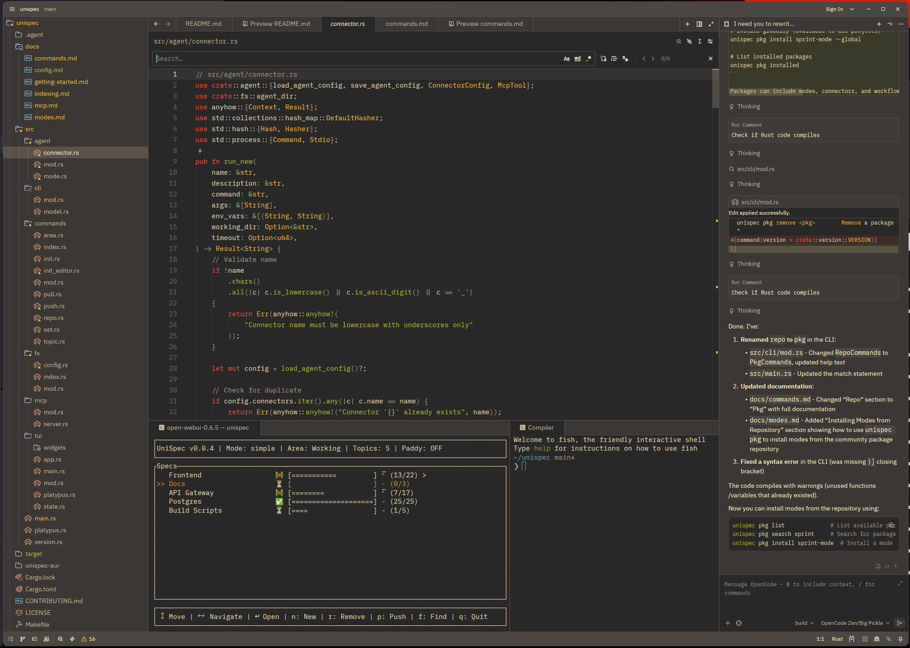
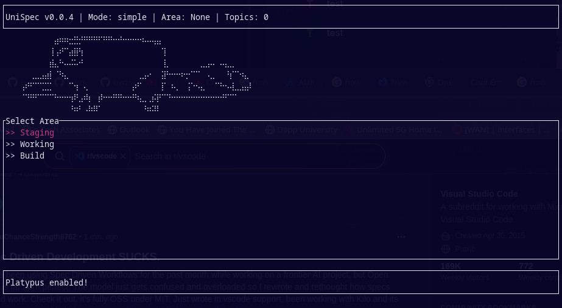

---

## Spec-Driven Development That Doesn't Suck.

Write specs. Build code. Ship software. Structured clarity for humans and clankers alike! No more cognitive debt. All in our favorite RustLang 🦀

[![zread](https://img.shields.io/badge/Ask_Zread-_.svg?style=flat&color=00b0aa&labelColor=000000&logo=data%3Aimage%2Fsvg%2Bxml%3Bbase64%2CPHN2ZyB3aWR0aD0iMTYiIGhlaWdodD0iMTYiIHZpZXdCb3g9IjAgMCAxNiAxNiIgZmlsbD0ibm9uZSIgeG1sbnM9Imh0dHA6Ly93d3cudzMub3JnLzIwMDAvc3ZnIj4KPHBhdGggZD0iTTQuOTYxNTYgMS42MDAxSDIuMjQxNTZDMS44ODgxIDEuNjAwMSAxLjYwMTU2IDEuODg2NjQgMS42MDE1NiAyLjI0MDFWNC45NjAxQzEuNjAxNTYgNS4zMTM1NiAxLjg4ODEgNS42MDAxIDIuMjQxNTYgNS42MDAxSDQuOTYxNTZDNS4zMTUwMiA1LjYwMDEgNS42MDE1NiA1LjMxMzU2IDUuNjAxNTYgNC45NjAxVjIuMjQwMUM1LjYwMTU2IDEuODg2NjQgNS4zMTUwMiAxLjYwMDEgNC45NjE1NiAxLjYwMDFaIiBmaWxsPSIjZmZmIi8%2BCjxwYXRoIGQ9Ik00Ljk2MTU2IDEwLjM5OTlIMi4yNDE1NkMxLjg4ODEgMTAuMzk5OSAxLjYwMTU2IDEwLjY4NjQgMS42MDE1NiAxMS4wMzk5VjEzLjc1OTlDMS42MDE1NiAxNC4xMTM0IDEuODg4MSAxNC4zOTk5IDIuMjQxNTYgMTQuMzk5OUg0Ljk2MTU2QzUuMzE1MDIgMTQuMzk5OSA1LjYwMTU2IDE0LjExMzQgNS42MDE1NiAxMy43NTk5VjExLjAzOTlDNS42MDE1NiAxMC42ODY0IDUuMzE1MDIgMTAuMzk5OSA0Ljk2MTU2IDEwLjM5OTlaIiBmaWxsPSIjZmZmIi8%2BCjxwYXRoIGQ9Ik0xMy43NTg0IDEuNjAwMUgxMS4wMzg0QzEwLjY4NSAxLjYwMDEgMTAuMzk4NCAxLjg4NjY0IDEwLjM5ODQgMi4yNDAxVjQuOTYwMUMxMC4zOTg0IDUuMzEzNTYgMTAuNjg1IDUuNjAwMSAxMS4wMzg0IDUuNjAwMUgxMy43NTg0QzE0LjExMTkgNS42MDAxIDE0LjM5ODQgNS4zMTM1NiAxNC4zOTg0IDQuOTYwMVYyLjI0MDFDMTQuMzk4NCAxLjg4NjY0IDE0LjExMTkgMS42MDAxIDEzLjc1ODQgMS42MDAxWiIgZmlsbD0iI2ZmZiIvPgo8cGF0aCBkPSJNNCAxMkwxMiA0TDQgMTJaIiBmaWxsPSIjZmZmIi8%2BCjxwYXRoIGQ9Ik00IDEyTDEyIDQiIHN0cm9rZT0iI2ZmZiIgc3Ryb2tlLXdpZHRoPSIxLjUiIHN0cm9rZS1saW5lY2FwPSJyb3VuZCIvPgo8L3N2Zz4K&logoColor=ffffff)](https://zread.ai/uwzis/UniSpec)

---

[](https://www.rust-lang.org/)
[](LICENSE)
[](https://crates.io/crates/unispec)
[](https://github.com/uwzis/unispec)
[](https://aur.archlinux.org/packages/unispec)
[](https://github.com/uwzis/unispec)
[](https://github.com/uwzis/unispec/pulls)
[](https://github.com/uwzis/unispec/stargazers)
[](https://github.com/uwzis/unispec/network)


---

## The Problem

You write code. Then you write more code. Then someone asks "wait, what are we building again?" and nobody remembers. Your AI models constantly hallucinate and go on a bender while your team has no idea how things work. But it just works... for now.

For us, we're creating a frontier infrastructure project and found that spec-driven development gave us some efficiency at waterfalling, but became a nightmare when debugging large and complex codebases. Using OpenSpec, BMAD, and SpecKit was starting to destroy our work.

---

## The Fix

UniSpec is a fully open source spec-driven development orchestrator that allows you to build your own spec-driven workflows that can work inside production environments. This allows you to create specs in a tree-like format so your code is fully referenced and documented.

This splits up the development process into 3 concepts:

- **Modes** – Custom built workflows for your IDE agents
- **Areas** – Specification workspaces designed for your objectives
- **Topics** – Defined subjects that can nest into trees of specifications

---

## Quick Start

```bash
# Install from source
git clone https://github.com/uwzis/unispec.git
cd unispec
cargo install unispec

# Or from Arch Linux AUR
yay -S unispec

# Initialize
mkdir project && cd project
unispec init

# Launch TUI
unispec
```


---

## Core Concepts 🔥

### Areas (Default Mode)

| Area | Purpose |
|------|---------|
| **Staging** | Writing specs |
| **Working** | Writing code |
| **Testing** | Running build & test pipelines |
| **Fixing** | Repairing issues from Testing |
| **Build** | Done. Treated as immutable. |

### Indexing (The Secret Sauce)

```bash
# Link code to a spec
unispec index add --topic "user-login" --path src/auth/login.rs
unispec index add --topic "user-login" --path tests/login_test.py

# Now AI knows which code implements which feature
```

### Modes

Custom workflows for different teams. The default mode ships at `.agent/modes/default/` and uses the five-area pipeline above. Additional modes (sprint, kanban, RFC, docs) can be installed from the community package repository or built by hand — see [docs/modes.md](docs/modes.md).

---

## Using Packages

You can install custom nodes from the community, [Here](https://github.com/uwzis/UniSpec-Modes) for more details.
```bash
# List available packages
unispec pkg list

# Install a package to current project
unispec pkg install default-modes

# Install globally (system-wide)
unispec pkg install default-modes --global

# Install from a GitHub URL directly
unispec pkg install https://github.com/username/unispec-modes

# List installed packages
unispec pkg installed

# List globally installed packages
unispec pkg installed --global

# Remove a package
unispec pkg remove sprint-mode
```

---

## Editor Integrations

UniSpec plays nice with 24 AI editors. When you run `unispec init`, it can set up your editor:

```bash
unispec init --cursor --cline --windsurf
```

Supported editors:

| Editor | CLI Flag | Editor | CLI Flag |
|--------|----------|--------|----------|
| Amazon Q | `--amazon-q` | Kilo Code | `--kilo-code` |
| Antigravity | `--antigravity` | Kiro | `--kiro` |
| Augment | `--auggie` | OpenCode | `--opencode` |
| Claude Code | `--claude-code` | Pi | `--pi` |
| Cline | `--cline` | Qoder | `--qoder` |
| Codex | `--codex` | Qwen Code | `--qwen-code` |
| CodeBuddy | `--codebuddy` | RooCode | `--roo-code` |
| Continue | `--continue` | Windsurf | `--windsurf` |
| CoStrict | `--costrict` | TRAE | `--trae` |
| Crush | `--crush` | Cursor | `--cursor` |
| Factory | `--factory` | Gemini CLI | `--gemini-cli` |
| GitHub | `--github` | iFlow | `--iflow` |

Or use `--all` to set up all of them.

**Bonus:** I use Zed - just copy the commands into the Rules. Highly recommend Zed!

---

## What Goes In A Spec?

1. What problem are we solving?
2. Who is this for?
3. What are we building? (be specific)
4. How do we know it's done? (acceptance criteria)
5. What's NOT included?

Then `tasks.md` breaks it into actionable chunks.

---

## Meeting Paddy the Platypus 🔥

There's a platypus named **Paddy** in the TUI. He's here to be like your personal cheerleader for all you ADHD GenZ Tik-Tok glued addicts like myself. He is just a reminder that you can do it! Toggle him with `\` in the TUI.

He believes in you. 🦫

---

## What's Next?

- [Getting Started](docs/getting-started.md) - Full walkthrough
- [Commands Reference](docs/commands.md) - All CLI commands
- [Creating Modes](docs/modes.md) - Build custom workflows
- [MCP Integration](docs/mcp.md) - Connect AI agents
- [Indexing](docs/indexing.md) - Link code to specs
- [Repository](repo/README.md) - Community modes & packages

---

**Remember**: Code is what computers run. Specs are what humans understand. Write the spec first, work based off understanding.



— Paddy the Platypus 🦫
