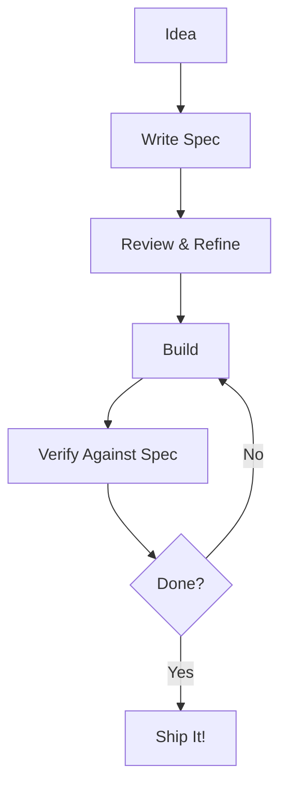

# OpenSDD - Open Spec-Driven Development


**UniSpec** is a spec-driven development methodology with a TUI interface that helps teams write specs before they write code, track progress across areas, and build software with confidence. Plus, there's a platypus.

## The Vision

We believe **great software starts with great specs**. Before you write a single line of code, you should know:

1. What problem you're solving
2. Who it's for
3. How you'll know when it's done
4. What "done" actually looks like

OpenSDD isn't about bureaucracy or waterfall planning. It's about **clarity before code**. Think of it as a conversation with your future self and your team: "Here's what we're building, here's why, and here's how we'll know we succeeded."

The platypus? He's just here to make the paperwork less painful. His name is **Patty**. Patty believes in you.

## Why Spec-Driven Development?



Most projects fail not because of bad code, but because of **bad communication**. Specs are the contract between:
- You and your team
- You and your future self
- You and the agent helping you code

## Quick Start

```bash
# Install (when published)
cargo install osdd

# Initialize a project
osdd init

# Launch the TUI
osdd

# Or use CLI commands
osdd area list
osdd topic add "User Authentication" -a Staging
```

## The TUI

Run `osdd` without arguments to launch the terminal user interface:

```
┌─────────────────────────────────────────────┐
│ Open SDD v0.5.0  | Area: Working | Topics: 12│
├─────────────────────────────────────────────┤
│                                             │
│     ⠀⠀⠀⠀⠀⣴⠶⠶⣒⣛⣛⣛⣛⠛⠒⠒...     │
│     ⠀⠀🦫                                │
│                                             │
├─────────────────────────────────────────────┤
│ ▶ user-authentication    ✅ ████████████  │
│   api-redesign           ⏳ █████░░░░░░░  │
│   payment-flow           🚧 ████░░░░░░░░  │
├─────────────────────────────────────────────┤
│ 🡙 Move | 🡘 Navigate | ↵ Open | n: New | q │
└─────────────────────────────────────────────┘
```

### Navigation

| Key | Action |
|-----|--------|
| `↑` / `↓` | Move between topics |
| `→` / `←` | Navigate into/out of topics |
| `Enter` | Open topic or file |
| `n` | Create new topic |
| `r` | Remove topic |
| `p` | Push topic to another area |
| `f` | Find files linked to topic |
| `\` | Toggle Patty (secret!) |
| `q` | Quit |

## Areas

OpenSDD organizes work into **Areas** - stages in your development workflow:

| Area | Purpose |
|------|---------|
| **Staging** | Specs being written and refined |
| **Working** | Specs being built into code |
| **Build** | Completed, shippable code |

You can customize these or add your own areas.

### Area Commands

```bash
# List all areas
osdd area list

# Add a new area
osdd area add Review

# Remove an area (if empty)
osdd area remove Review

# Rename an area
osdd area rename Staging Draft

# Set default area
osdd area default Working

# Check area health
osdd area health
```

## Topics

**Topics** are the core unit of work in OpenSDD. A topic contains:

- `spec.md` - The specification
- `tasks.md` - Checkable tasks
- Linked files - Code, tests, docs

### Topic Commands

```bash
# Create a topic
osdd topic add "User Authentication" -a Staging

# List topics
osdd topic list -a Staging

# Push to another area
osdd topic push "User Authentication" Working

# Show topic details
osdd topic show user-authentication

# Check progress
osdd topic progress -a Working

# Remove a topic
osdd topic remove user-authentication
```

## Index - Linking Files to Specs

The index connects your specs to the actual files:

```bash
# Link a file to a topic
osdd index add --topic user-auth --path src/auth/login.rs

# Link a directory
osdd index add --topic user-auth --path src/auth/ --type directory

# Find what specs a file belongs to
osdd index find src/auth/login.rs --by path

# Find files linked to a spec
osdd index find user-auth --by topic

# Full index stats
osdd index full
```

## Agent Modes

OpenSDD supports different **modes** that define:
- Agent persona and behavior
- Workflow steps
- Custom templates
- Area definitions

### Mode Commands

```bash
# List available modes
osdd mode list

# Show mode details
osdd mode info simple

# Activate a mode
osdd mode activate simple

# Add a custom mode
osdd mode add /path/to/my-mode

# Remove a mode
osdd mode remove custom-mode

# Show current mode
osdd mode current
```

### Modes Directory

Modes are stored in:
- **Local**: `.agent/modes/<mode_name>/`
- **Global**: `~/.config/osdd/modes/<mode_name>/`

See [Simple Mode Documentation](docs/simple-mode/) for the default mode.

## Connectors

Connectors are custom commands that become MCP tools for AI agents:

```bash
# Create a connector
osdd connector new test "Run test suite" "pytest" "tests/" "-v"

# List connectors
osdd connector list

# Run a connector
osdd connector run test

# Edit description
osdd connector edit test "Run the full test suite with verbose output"

# Delete a connector
osdd connector delete test

# Generate MCP config (for Claude Desktop, etc.)
osdd connector mcp
```

### Example MCP Configuration

```json
{
  "mcpServers": {
    "osdd": {
      "command": "osdd",
      "args": ["connector", "mcp"]
    }
  }
}
```

## Platypus Control

Patty the Platypus can be toggled on/off:

```bash
# Enable platypus (shows after commands)
osdd patty enable

# Disable platypus
osdd patty disable

# Check status
osdd patty status
```

**Secret**: Press `\` in the TUI to toggle Patty.

## Configuration

Config lives in `.agent/config.toml`:

```toml
# OpenSDD Agent Configuration

# Current active mode
current_mode = "simple"

# Default area for topic operations
default_area = "Working"

# Protected areas that cannot be deleted
protected_areas = ["Staging", "Working", "Build"]

# Connectors - Custom commands that become MCP tools
[[connector]]
name = "test"
description = "Run the test suite"
command = "pytest"
args = ["tests/", "-v"]
```

## Integrating with AI Agents

OpenSDD is designed for AI-assisted development. Here's how to use it with different agents:

### Claude Desktop

Add to your `claude_desktop_config.json`:

```json
{
  "mcpServers": {
    "osdd": {
      "command": "osdd",
      "args": ["connector", "mcp"]
    }
  }
}
```

### Continue (VS Code / JetBrains)

Add to `.continue/config.json`:

```json
{
  "models": [{
    "title": "Claude",
    "provider": "anthropic"
  }],
  "mcpServers": {
    "osdd": {
      "command": "osdd",
      "args": ["connector", "mcp"]
    }
  }
}
```

### Zed

Add to `.zed/settings.json`:

```json
{
  "lsp": {
    "osdd": {
      "command": "osdd",
      "args": ["connector", "mcp"]
    }
  }
}
```

## Editor Setup

### VS Code

Create `.vscode/tasks.json` for quick commands:

```json
{
  "version": "2.0.0",
  "tasks": [
    {
      "label": "OpenSDD: Launch TUI",
      "type": "shell",
      "command": "osdd"
    },
    {
      "label": "OpenSDD: List Topics",
      "type": "shell", 
      "command": "osdd topic list",
      "problemMatcher": []
    },
    {
      "label": "OpenSDD: Area Health",
      "type": "shell",
      "command": "osdd area health",
      "problemMatcher": []
    }
  ]
}
```

**VS Code Keybindings** - Add to `keybindings.json`:

```json
[
  {
    "key": "ctrl+shift+s",
    "command": "workbench.action.tasks.runTask",
    "args": "OpenSDD: Launch TUI"
  }
]
```

### Neovim

Add to your `init.lua`:

```lua
vim.api.nvim_create_user_command('Osdd', function()
  vim.fn.jobstart({'osdd'}, { detach = true })
end, {})

vim.api.nvim_create_user_command('OsddList', function()
  vim.fn.jobstart({'osdd', 'topic', 'list'}, {
    stdout_buffered = true,
    on_stdout = function(_, data)
      print(table.concat(data, '\n'))
    end
  })
end, {})

vim.api.nvim_create_user_command('OsddHealth', function()
  vim.fn.jobstart({'osdd', 'area', 'health'}, {
    stdout_buffered = true,
    on_stdout = function(_, data)
      print(table.concat(data, '\n'))
    end
  })
end, {})

-- Optional: Keybindings
vim.keymap.set('n', '<leader>os', ':Osdd<CR>', { noremap = true, silent = true })
vim.keymap.set('n', '<leader>ol', ':OsddList<CR>', { noremap = true, silent = true })
vim.keymap.set('n', '<leader>oh', ':OsddHealth<CR>', { noremap = true, silent = true })
```

**LazyVim Integration**:

```lua
-- in plugins/osdd.lua
return {
  "your-name/osdd.nvim",
  -- or use vim.fn.executable to check
  lazy = true,
  cmd = { "Osdd", "OsddList" },
  config = function()
    -- your config
  end
}
```

### Helix

Add to `config.toml`:

```toml
[keys.normal]
g = { c = "osdd topic list" }  # Add a custom command

[tools]
# Helix doesn't have native task runner integration,
# but you can use :sh in insert mode
```

### Emacs

Add to `init.el`:

```elisp
(defun osdd-launch ()
  "Launch OpenSDD TUI"
  (interactive)
  (let ((compilation-buffer-name-function (lambda (_) "*osdd*")))
    (compile "osdd")))

(defun osdd-topic-list ()
  "List OpenSDD topics"
  (interactive)
  (shell-command "osdd topic list" "*osdd-topics*"))

(defun osdd-area-health ()
  "Show area health"
  (interactive)
  (shell-command "osdd area health" "*osdd-health*"))

;; Keybindings
(global-set-key (kbd "C-c o") 'osdd-launch)
(global-set-key (kbd "C-c t") 'osdd-topic-list)
(global-set-key (kbd "C-c h") 'osdd-area-health)
```

## Spec Template

When you create a topic, you get this structure:

### spec.md

```markdown
# Feature Name

## Problem Statement

[What problem does this solve? Why does it matter? Who experiences it?]

## User Stories

- As a **[user type]**, I want **[goal]** so that **[benefit]**
- As a **[user type]**, I want **[goal]** so that **[benefit]**

## Requirements

### Must Have
- [ ] Requirement 1
- [ ] Requirement 2

### Should Have
- [ ] Requirement 3

### Could Have
- [ ] Requirement 4

### Won't Have (This Iteration)
- [ ] Requirement 5

## Acceptance Criteria

- [ ] Criterion 1 - How we'll verify
- [ ] Criterion 2 - With specific metrics
- [ ] Criterion 3

## Out of Scope

- What we're NOT doing in this spec

## Technical Notes

[Any implementation details, API design, database schema, etc.]

## Dependencies

- [Link to related spec]
- External service requirements

## Open Questions

- [ ] Question 1?
- [ ] Question 2?
```

### tasks.md

```markdown
# Tasks - Feature Name

## Research
- [ ] Research existing solutions
- [ ] Evaluate third-party libraries
- [ ] Document technical approach

## Implementation
- [ ] Implement core functionality
- [ ] Add error handling
- [ ] Write unit tests

## Testing
- [ ] Write integration tests
- [ ] Manual testing checklist
- [ ] Performance testing

## Documentation
- [ ] Update README
- [ ] Add inline comments
- [ ] Create runbook

## Deployment
- [ ] Deploy to staging
- [ ] Smoke test
- [ ] Deploy to production
```

## MCP Server

Run OpenSDD as an MCP server for AI integration:

```bash
osdd mcp
```

This starts a server that AI agents can connect to for:
- Reading specs
- Checking task status
- Adding/updating topics
- Running connectors

## Workflows

Each mode can define custom workflows. For example, in Simple Mode:

### osdd:spec

1. Create topic in Staging
2. Write spec.md with all sections
3. Review and refine
4. Mark tasks as ready

### osdd:build

1. Pull topic to Working
2. Implement features
3. Run tests
4. Update tasks.md
5. Push to Build when complete

### osdd:verify

1. Review Build area
2. Run verification checklist
3. Ship it!

## Contributing

We welcome contributions! See guidelines below:

1. Fork the repo
2. Create a mode or improve the core
3. Write specs for your changes
4. Submit a PR

## License

MIT - Do whatever you want with it. That's the Open in OpenSDD.

---

## The Patty Principle

Every great development tool needs a mascot. Ours is a platypus named **Patty**.

Why a platypus? Because platypuses are:
- **Unique** - Nobody else does it quite like them
- **Adaptable** - At home in water or on land (CLI or TUI)
- **Surprisingly capable** - Venom spurs, electroreception, egg-laying mammals
- **A bit weird** - And that's what makes them memorable

Patty's philosophy: "Every spec is a chance to build something great. I'm here to make sure you don't skip the spec."

### Patty's Tips

- "Write specs like you're explaining to a smart friend, not a lawyer"
- "A task without a spec is just a guess"
- "The index is your friend - it connects code to purpose"
- "Don't delete areas, archive them"
- "Push early, push often"

---

**Remember**: Write the spec first. Patty believes in you. 🦫

*"A platypus without a spec is just a weird duck."* - Patty, probably
